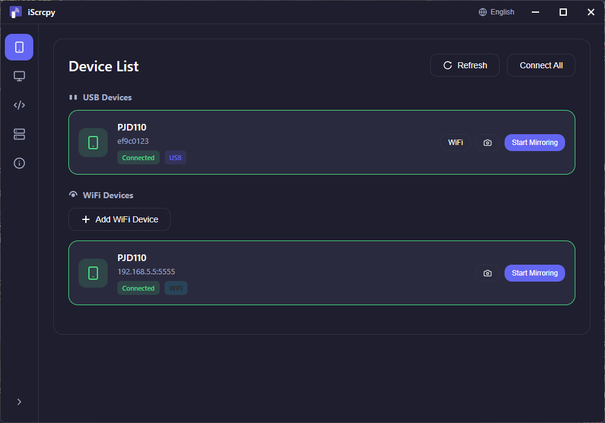

<div align="center">
  

  # iScrcpy

  **scrcpy tabanlı Android cihaz yansıtma aracı**

  [](#)
  [](#)
  [](#)
  [](#)
  [](#)

  [English](README.md) | [简体中文](README_CN.md) | [日本語](README_JA.md) | [한국어](README_KO.md) | [Español](README_ES.md) | [Français](README_FR.md) | [Türkçe](README_TR.md)
</div>

---



## Özellikler

- **Çok Dilli Destek**: 7 dil (Çince, İngilizce, Japonca, Korece, İspanyolca, Fransızca, Türkçe)
- **Cihaz Yönetimi**: USB/WiFi cihazlarını tarama ve bağlama, gerçek zamanlı izleme
- **Görüntü Ayarları**: Çözünürlük, bit hızı, kare hızı, pencere seçenekleri, kayıt zaman sınırı özelleştirme
- **Pencere Seçenekleri**: Kenarsız mod, ekran koruyucu devre dışı, her zaman üstte, tam ekran
- **Kayıt Özelliği**: Otomatik kayıt, zaman sınırı, özel kayıt yolu
- **Kamera Yansıtma**: Cihazın kamerasını yansıtma
- **Kodlama Ayarları**: Video/audio codec ve bit hızı modu yapılandırma
- **Sunucu Yapılandırması**: scrcpy sunucu yolları ve ADB ayarlarını yönetme
- **Windows Yerel**: Küçült/büyüt/kapat düğmeleriyle özel pencere
- **Koyu Tema**: shadcn/ui ilhamlı modern koyu arayüz

## Teknoloji Yığını

- **React 18** - Arayüz çerçevesi
- **Vite 5** - Derleme aracı
- **Electron 28** - Masaüstü çalışma zamanı
- **TypeScript** - Tip güvenliği
- **i18next** - Uluslararasılaştırma
- **Zustand** - Durum yönetimi
- **Electron Builder** - Yükleyici oluşturma

## Desteklenen Diller

iScrcpy 7 dilde mevcuttur:

| Dil | Kod | Yerel Ad |
|------|------|-----------|
| English | `en-US` | English |
| 简体中文 | `zh-CN` | 简体中文 |
| 日本語 | `ja-JP` | 日本語 |
| 한국어 | `ko-KR` | 한국어 |
| Español | `es-ES` | Español |
| Français | `fr-FR` | Français |
| Türkçe | `tr-TR` | Türkçe |

Dil, başlık çubuğundaki (küçült düğmesinin yanındaki) dil seçicisinden değiştirilebilir.

## Dokümantasyon

7 dilde detaylı kullanıcı kılavuzları mevcuttur:

| Dil | Doküman |
|------|---------|
| English | [documents/en-US.md](documents/en-US.md) |
| 简体中文 | [documents/zh-CN.md](documents/zh-CN.md) |
| 日本語 | [documents/ja-JP.md](documents/ja-JP.md) |
| 한국어 | [documents/ko-KR.md](documents/ko-KR.md) |
| Español | [documents/es-ES.md](documents/es-ES.md) |
| Français | [documents/fr-FR.md](documents/fr-FR.md) |
| Türkçe | [documents/tr-TR.md](documents/tr-TR.md) |

### Hızlı Bağlantılar (Türkçe)

- [Hızlı Başlangıç](documents/tr-TR.md#hızlı-başlangıç)
- [Cihazları Bağlama](documents/tr-TR.md#cihazları-bağlama)
- [Görüntü Ayarları](documents/tr-TR.md#görüntü-ayarları)
- [Kayıt Özelliği](documents/tr-TR.md#kayıt)
- [Kamera Yansıtma](documents/tr-TR.md#kamera-yansıtma)
- [SSS](documents/tr-TR.md#sss)

## Proje Yapısı

```text
iScrcpy/
├── app/                    # scrcpy ikili dosyaları ve bağımlılıklar
│   ├── win/                # Windows ikili dosyaları
│   │   ├── scrcpy.exe      # scrcpy çalıştırılabilir
│   │   ├── scrcpy-server   # scrcpy sunucu jar
│   │   ├── adb.exe         # ADB çalıştırılabilir
│   │   ├── SDL2.dll        # SDL2 kütüphanesi
│   │   └── *.dll           # Gerekli DLL'ler (avcodec, avformat, vb.)
│   ├── mac/                # macOS ikili dosyaları
│   │   ├── scrcpy
│   │   ├── scrcpy-server
│   │   ├── adb
│   │   └── scrcpy.1        # Manuel sayfası
│   └── linux/              # Linux ikili dosyaları
│       ├── scrcpy
│       ├── scrcpy-server
│       ├── adb
│       └── scrcpy.1        # Manuel sayfası
├── electron/               # Electron ana işlem
│   ├── main.ts             # IPC işleyicileri ile ana işlem
│   ├── main.cjs            # Derlenmiş ana işlem
│   ├── preload.ts          # IPC köprüsü ön yükleme scripti
│   ├── preload.cjs         # Derlenmiş ön yükleme scripti
│   ├── logger.ts           - Günlükçü aracı
│   └── resources/          # Derleme kaynakları
├── src/                    # React uygulaması
│   ├── main.tsx            # Giriş noktası
│   ├── App.tsx             # Kök bileşen
│   ├── i18n/               # Uluslararasılaştırma
│   │   ├── index.ts        # i18n yapılandırması
│   │   └── locales/        # Çeviri dosyaları
│   │       ├── zh-CN.json
│   │       ├── en-US.json
│   │       ├── ja-JP.json
│   │       ├── ko-KR.json
│   │       ├── es-ES.json
│   │       ├── fr-FR.json
│   │       └── tr-TR.json
│   ├── components/         # Yeniden kullanılabilir bileşenler
│   │   ├── TitleBar.tsx    # Dil seçicili başlık çubuğu
│   │   ├── Sidebar.tsx     # Gezinme yan çubuğu
│   │   ├── DeviceCard.tsx  # Cihaz kartı bileşeni
│   │   ├── FileManager.tsx # Dosya yönetimi dialogu
│   │   ├── CloseConfirmDialog.tsx  # Kapatma onay dialogu
│   │   ├── UpdateDialog.tsx        # Güncelleme bildirim dialogu
│   │   └── ui/             # shadcn/ui tarzı bileşenler
│   │       ├── button.tsx
│   │       ├── card.tsx
│   │       ├── checkbox.tsx
│   │       ├── label.tsx
│   │       ├── select.tsx
│   │       ├── separator.tsx
│   │       ├── sheet.tsx
│   │       └── sonner.tsx
│   ├── pages/              # Sayfa bileşenleri
│   │   ├── DevicePage.tsx  # Cihaz yönetimi sayfası
│   │   ├── DisplayPage.tsx # Görüntü ayarları sayfası
│   │   ├── EncodingPage.tsx    # Kodlama ayarları sayfası
│   │   ├── ServerPage.tsx      # Sunucu yapılandırma sayfası
│   │   ├── LogsPage.tsx        # Uygulama günlükleri sayfası
│   │   └── AboutPage.tsx       # Hakkında sayfası
│   ├── store/              # Durum yönetimi (Zustand)
│   │   └── deviceStore.ts  # Cihaz durumu deposu
│   ├── lib/                # Yardımcı kütüphaneler
│   │   └── utils.ts        # Yardımcı fonksiyonlar
│   ├── styles/             # CSS stilleri
│   │   └── index.css       # Genel stiller
│   ├── utils/              # Yardımcı programlar
│   │   └── electron.ts     - Electron API köprüsü
│   ├── types/              # TypeScript tip tanımları
│   │   └── electron.d.ts   # Electron tip bildirimleri
│   ├── assets/             # Statik varlıklar
│   │   └── icon.png        # Uygulama simgesi
│   └── vite-env.d.ts       # Vite tip bildirimleri
├── documents/              # Kullanıcı dokümantasyonu (7 dil)
│   ├── en-US.md            # İngilizce kullanıcı kılavuzu
│   ├── zh-CN.md            # Çince kullanıcı kılavuzu
│   ├── ja-JP.md            # Japonca kullanıcı kılavuzu
│   ├── ko-KR.md            # Korece kullanıcı kılavuzu
│   ├── es-ES.md            # İspanyolca kullanıcı kılavuzu
│   ├── fr-FR.md            # Fransızca kullanıcı kılavuzu
│   └── tr-TR.md            # Türkçe kullanıcı kılavuzu
├── images/                 # Ekran görüntüleri ve varlıklar
│   └── iScrcpy.png         # Ana arayüz ekran görüntüsü
├── logs/                   # Uygulama günlükleri
├── index.html              # HTML girişi
├── package.json            # Bağımlılıklar
├── vite.config.ts          # Vite yapılandırması
├── electron.vite.config.ts # Electron Vite yapılandırması
├── tsconfig.json           # TypeScript yapılandırması
└── forge.config.cjs        # Electron Forge yapılandırması
```

## Hızlı Başlangıç

### 1. Bağımlılıkları Yükle

```bash
npm install
```

### 2. Geliştirme Modunda Çalıştır

```bash
npm run dev
```

### 3. Test Modu (Sahte Cihazlar)

```bash
TEST=1 npm run dev
```

### 4. Üretim için Derle

```bash
npm run build
```

Bu, `dist-win/` klasöründe bir `.exe` yükleyici oluşturacaktır.

## scrcpy Seçenekleri

| Seçenek | Açıklama |
|-----------------------------|------------------------------------|
| `--max-size=<n>` | Maksimum video boyutu |
| `--video-bit-rate=<n>` | Video bit hızı (Mbps) |
| `--max-fps=<n>` | Maksimum kare hızı |
| `--video-codec=<c>` | Video codec (h264, h265, av1) |
| `--audio-codec=<c>` | Audio codec (opus, aac) |
| `--video-encoder=<name>` | Belirli video kodlayıcı adı |
| `--always-on-top` | Pencereyi her zaman üstte tut |
| `--fullscreen` / `-f` | Tam ekranda başlat |
| `--stay-awake` | Ekranı açık tut |
| `--window-borderless` | Kenarsız pencere modu |
| `--disable-screensaver` | Ekran koruyucuyu devre dışı bırak |
| `--record=<file>` | Ekranı dosyaya kaydet |
| `--time-limit=<s>` | Kayıt zaman sınırı (saniye) |
| `--tunnel-forward` | İleri tünel modu kullan |
| `--no-cleanup` | Çıkışta sunucuyu temizleme |

## Geliştirme

### Yeni Dil Ekleme

1. `src/i18n/locales/` içinde yeni bir çeviri dosyası oluşturun (örn: `de-DE.json`)
2. Mevcut bir dil dosyasından yapıyı kopyalayın
3. Tüm metin dizelerini çevirin
4. Dili `src/i18n/index.ts` içinde kaydedin:

```typescript
import deDE from './locales/de-DE.json';

const resources = {
  ...
  'de-DE': { translation: deDE },
};

export const languages = [
  ...
  { code: 'de-DE', name: 'German', nativeName: 'Deutsch' },
];
```

### Bileşenlerde Çeviri Kullanma

```typescript
import { useTranslation } from 'react-i18next';

export default function MyComponent() {
  const { t } = useTranslation();
  
  return (
    <div>
      <h1>{t('devices.title')}</h1>
      <button>{t('devices.refresh')}</button>
    </div>
  );
}
```

## Katkı

Katkılarınız memnuniyetle karşılanır! Lütfen Pull Request göndermekten çekinmeyin.

### Katkıda Bulunma Yolları

- GitHub Issues üzerinden hata bildirimi veya özellik önerisi
- Ekstra diller için yeni çeviriler ekleme
- Dokümantasyonu iyileştirme
- Kod iyileştirmeleri gönderme

## Teşekkürler

- [scrcpy](https://github.com/Genymobile/scrcpy) - Harika Android yansıtma aracı
- [shadcn/ui](https://ui.shadcn.com/) - Arayüz bileşenleri ilham kaynağı
- Tüm katkıda bulunanlar ve çevirmenler

## Lisans

Apache License 2.0

Apache Lisansı, Sürüm 2.0 (bundan böyle "Lisans" olarak anılacaktır) kapsamında lisanslanmıştır;
bu dosyayı Lisans'a uygun olmadığınız sürece kullanamazsınız.
Lisansın bir kopyasını şu adresten edinebilirsiniz:

    http://www.apache.org/licenses/LICENSE-2.0

Yasalarca gerektirmediği veya yazılı olarak kararlaştırılmadığı sürece,
Lisans altında dağıtılan yazılım "OLDUĞU GİBİ",
GARANTİ VEYA KOŞUL OLMADAN, açık veya örtülü herhangi bir garanti veya koşul olmaksızın dağıtılır.
Lisans kapsamındaki belirli izinler ve kısıtlamalar için Lisans'a bakın.
